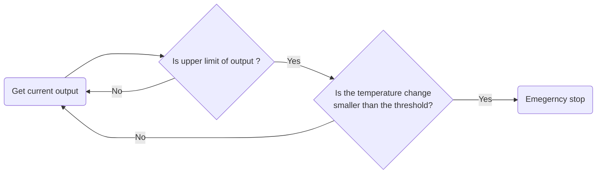
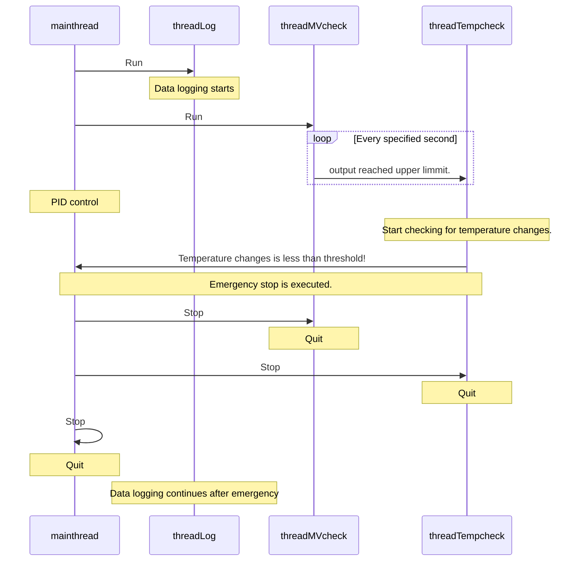
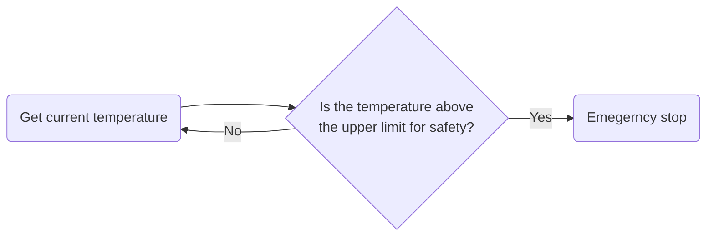
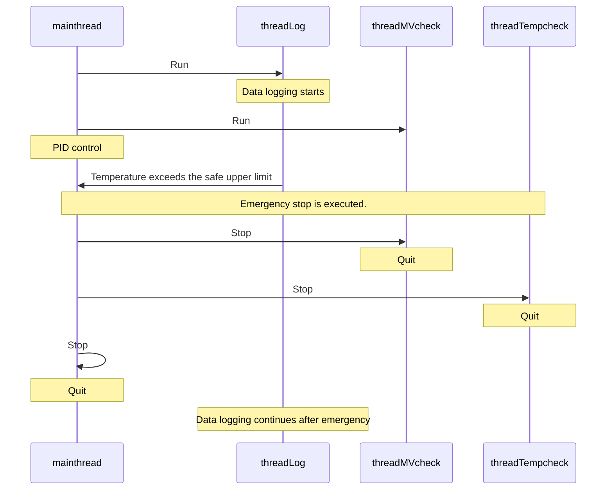
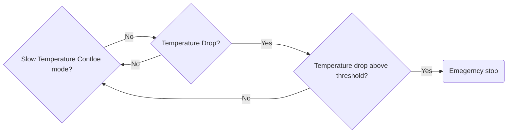
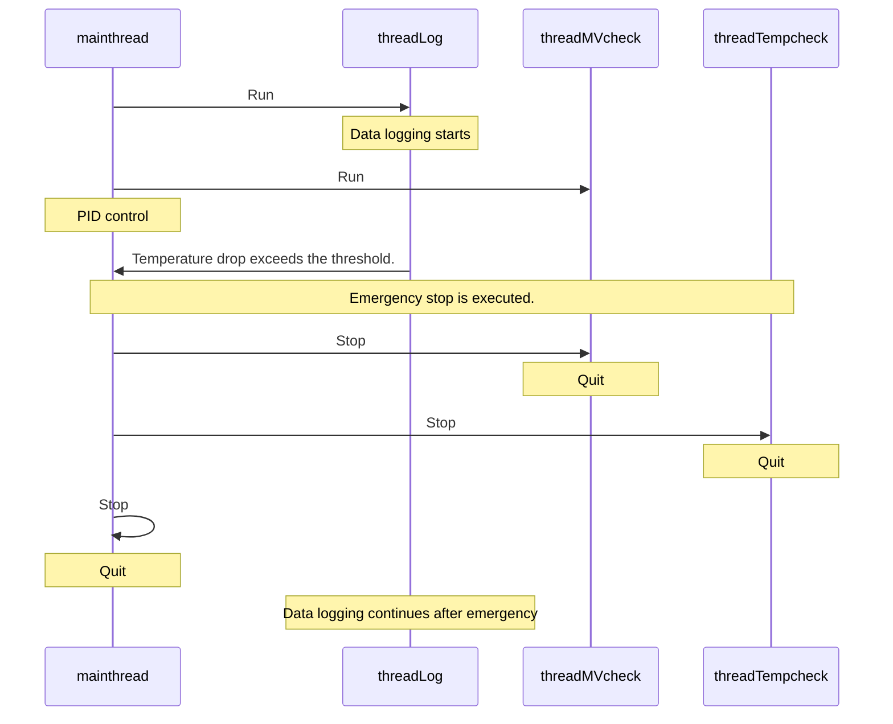

Table of Contents
- [1. Source code \& Contents](#1-source-code--contents)
- [2. branches](#2-branches)
  - [2.1. main](#21-main)
  - [2.2. 2023\_Qt6](#22-2023_qt6)
- [3. Getting started](#3-getting-started)
  - [3.1. Setting E5CC](#31-setting-e5cc)
    - [3.1.1. Input type](#311-input-type)
    - [3.1.2. To communicate](#312-to-communicate)
    - [3.1.3. Summary of setting items](#313-summary-of-setting-items)
  - [3.2. .exe user](#32-exe-user)
  - [3.3. Qt user](#33-qt-user)
- [4. OmronPID.exe](#4-omronpidexe)
  - [4.1. Processing for safety](#41-processing-for-safety)
    - [4.1.1. TempCheck mode](#411-tempcheck-mode)
    - [4.1.2. Upper Limit](#412-upper-limit)
    - [4.1.3. TempDrop](#413-tempdrop)
  - [4.2. GUI](#42-gui)
    - [4.2.1. Connection to E5CC](#421-connection-to-e5cc)
    - [4.2.2. Data Save](#422-data-save)
    - [4.2.3. Run/Stop](#423-runstop)
    - [4.2.4. Background Color](#424-background-color)
# 1. Source code & Contents
[Original source code](https://github.com/TripletESR/Omron_PID) can be get.
```bash
git clone https://github.com/TripletESR/Omron_PID.git
```
The original souce is be abailable in Qt4 or 5.　Here, we develop applications with additional functions, mainly for safety. The source code added safety functions is available the following
```bash
git clone https://github.com/daimiura/OmronPID.git
```
The contents are 
- html
- latex
- release
- other files (*.cpp, *.h and so on)

The reference manuals for functions, etc. are generated by Doxygen (sorry for the little I have written). html, and latex directories are for the reference manuals.
The reference manual can be seen by opening
```bash
html/index.html
```
in your browser.

Omron_PID.exe, the application that controls E5CC, resides in the release directory. This directory also contains the DLL files necessary to run this .exe file.

# 2. branches
## 2.1. main
This branch is stable version.　It corresponds to Qt4 and 5 and was written in code tailored to Qt5.

## 2.2. 2023_Qt6
In Qt6, thisis not available because some functions are obsolute.　To use it in Qt6, this source code needs to be rewritten.　The update is developpoing in the 2023_Qt6 branch.　Now the contents in 2023_Qt6 include some issues, so  it is not available. 

# 3. Getting started
This section describes how to use the OmronPID.exe and install Qt.
## 3.1. Setting E5CC
### 3.1.1. Input type
This application is designed to use a K thermocouple as a thermometer probe (See that the [manual](manuals/e5cc_inst-5377443-6a.pdf) for thermocouple wiring and channels). <span style = "color:blue">Select the input type 6</span> (Default is 5. Reffer [manual for connection](manuals/e5cc_inst-5377443-6a.pdf) how to select input type).
### 3.1.2. To communicate
The setting items required for communication are as follows:
- Protocol selection : Mod
- Unit No. : 1
- bit per sec : 9.6
- Parity : None
- Send waiting time : 20

See [communication manual](manuals/communicationmanual.pdf) that how to set the parameters for communication.

### 3.1.3. Summary of setting items
The lists of setting items are summarized in the following table.
|Items|Sign|Default|to be set|
|---|---|---|---|
|Input Type|CN-t|5|6|
|Protocol selection|PSEL|CWF|Mod|
|Unit No.|U-No|1|1|
|bit per sec|bPS|9.6|9.6|
|Parity|PRty|EVEN|None|
|Send waiting time|SdWt|20|20|

## 3.2. .exe user
You can use OmronPID.exe if only you download the [release directory](https://github.com/daimiura/OmronPID).
At first, connect E5CC to PC via USB cable. Then execute OmronPID.exe. If you have problems, it can be not exist dll files. The error messages show the dll files you need. After installing Qt5, copy the files from 
```bash
C/Qt/5.15.2/mingw81_64/bin/
```
to the release directory. 
If you get an error such as the Qt plugin is not installed, copy platform directory to the release directory.
The platform direcory locates
```bash
C/Qt/5.15.2/mingw81_64/plugins/
```


## 3.3. Qt user
Qt5 and 6 are available for free from [here](https://www.qt.io/download-qt-installer) (as of March 2023).　You need an account, so please create one.　You can register with your e-mail address.
For example, we will create a Qt directory under the C directory and install it there.
```bash
$ C/Qt/
```
ModBus communication is used with E5CC.
On the Component Selection page, install the components required for ModBus.
Qt Creator is useful for designing GUI, so Qt Creator should also be installed.　The required components are as follows (Qt 6 version is optional).
- Qt 6.5.0-rc
  - MinGW 11.2.0-64bit
  -  Qt 5 Compatibility Module
  -  Qt Shader Tools
  -  Additional Libraries
     -  Qt Serial Bus
     -  Qt Serial Port
- Qt 5.15.1
  - MinGW 8.1.0 64-bit
- Developper and Designer Tools
  - Qt Creator 9.0.2
  - Qt Creator 9.0.2 CDB Debugger Support
  - Debugging Tools for Windows
  - CMake 3.24.2
  - Ninja 1.10.2
- Qt Maintenance Tool
  
# 4. OmronPID.exe
## 4.1. Processing for safety
OmronPID.exe has three safety features
- TempCheck mode
- Upper Limit
- Temp Drop


The above functions are implemented using four threads to simultaneously handle PID control, output checking, temperature change checking, and logging.
- main thread : for PID control
- threadMVcheck : for output checking
- threadTempCheck : for temperature change checking
- threadLog : for logging


### 4.1.1. TempCheck mode
This mode checks for temperature changes. Normally, the temperature rises during heating. If there is some practical problem (e.g., the thermometer is not in the heat bath), the temperature detected by E5CC will not change. If the E5CC is commanded to heat, the temperature detected by the E5CC will remain unchanged (the heater is actually heating) even though it continues to output at the upper limit, which is dangerous and may result in a fire. To avoid this danger, TempCheck mode records temperature changes. This mode starts when the output reaches its maximum value. An emergency stop is performed if the temperature change is smaller than the threshold value. The flowchart is shown as follwing


The seaquenceDiagram displays the below. Note that all threads are started in parallel.　Even if the threadMV check is looping, other threads, such as mainthread and threadLog are doing their processing.



### 4.1.2. Upper Limit
Temperature, setpoint temperature, and output values are gotten using threadLog every specified second. If the temperature exceeds the safe upper limit (280 °C by default) at this time, an emergency stop is triggered in any case. The flowchart is shown the following. OmronPID.exe will continue to run as long as the safe maximum is not exceeded. After a specified number of seconds, it determines if the temperature exceeds the safe maximum again and repeats the process.

The seaquence diagram is shown the following.


### 4.1.3. TempDrop
The function executes an emergency stop when the temperature drops above a threshold (default 10 °C/min). The temperature change is calculated as the difference from the previous data when the temperature is acquired in ThreadLog. If the sign of the difference is negative, the Temperature Drop indicator on the GUI will light up. If the threshold is not exceeded, the PID control continues after the indicator lights up. Note that Emergency stop by TempDrop is not performed in  Slow Temperature Controle mode. 



The seaquence diagram is shown as the following (same as upper limit diagram).



## 4.2. GUI
### 4.2.1. Connection to E5CC
When OmronPID.exe starts up, it searches for E5CCs to communicate and displays them on the GUI. When the Connect button is pressed, the application connects with the displayed E5CC. The current temperature, set temperature, and output are acquired if the connection is successfully established. At the same time, it sends a command to stop heating to avoid unexpected heating.

### 4.2.2. Data Save
The temperature log is saved as
```bash
yyyyMMdd_hhmmss.dat
```
in the Dir path on the GUI of OmronPID.exe.　By default, the directory path is set to
```bash
Desktop/Temp_Record
```
. This directory is automatically generated (Note that this is unless the Z drive of the network drive is already assigned to RIKEN's Triplet-NAS). When the program is run, the file is automatically named with the date. The log will continue to be written to the same file until the program stops. When the program stops and runs again, a new file is created, and the log is saved.

If you want to specify a directory where you want the logs to be stored, enter the path to that directory. If it cannot be saved,
```bash
 "filepath" does not be found.
```
will appear in the Log Message. Please check the path is correct.

### 4.2.3. Run/Stop
The push button text changes dynamically to Run or Stop.　If the button is pressed when the text is Run, PID control starts. The background turns green.　At the same time, mainThread, threadMVcheck, and threadLog start running.　If the button is pressed when the text is Stop, the PID control is stopped, and the heating is finished. The background color changes to gray.　All threads stop.

### 4.2.4. Background Color
The background color changes according to the situation to make the problem visible.
|Condtion|color|
|---|---|
|Stop|Gray|
|Running|Green|
|TempCheck mode|Yellow|
|Emergency Stop|Red|
